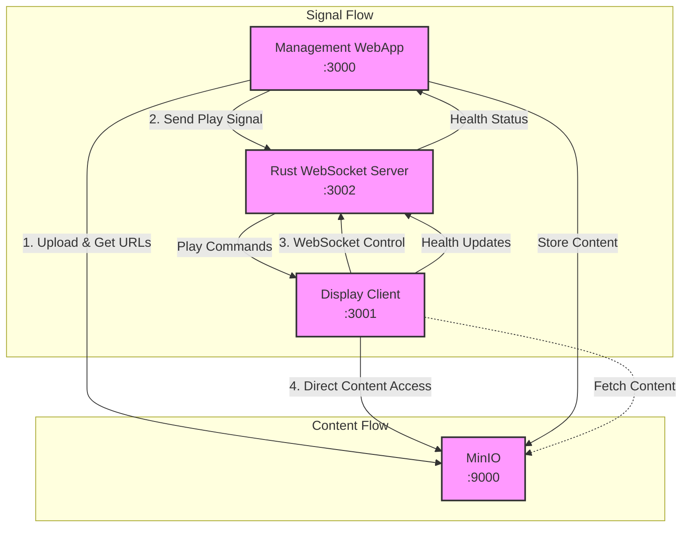

# Wrale Radiate

Global Display Manager - Steel Thread Implementation

Wrale Radiate is a digital signage management system built to handle video content distribution across multiple displays. This repository contains a steel thread implementation that proves the core workflow.

## Features

- ✅ Upload and distribute video content
- ✅ Real-time display health monitoring
- ✅ Basic display simulation
- ✅ Content delivery verification

## System Overview

The implementation demonstrates four core capabilities:

1. Content Management (MKTG_CONTENT_MGMT)
   - Upload video content via web interface
   - Track content delivery status
   - Manage content lifecycle

2. Content Transport (CAP_CONTENT_TRANSPORT)
   - Reliable content delivery to displays
   - Real-time content distribution
   - WebSocket-based updates

3. Basic Rendering (CAP_BASIC_RENDER)
   - H.264 video playback
   - Display status reporting
   - Automated content updates

4. Health Monitoring (CAP_DISPLAY_HEALTH)
   - Real-time display health tracking
   - Content playback verification
   - Connection status monitoring

## Architecture



### Technology Stack
- Frontend: TypeScript/Next.js 14
- Storage: MinIO
- Real-time: WebSocket (Rust-based server)
- Deployment: Docker/Podman Compose

### Components

1. Management Interface (Port 3000)
   - Content upload and management
   - Display health monitoring
   - Real-time status dashboard

2. Display Client (Port 3001)
   - Video playback simulation
   - Health reporting
   - WebSocket connectivity

3. Storage Layer
   - MinIO object storage (Port 9000/9001)
   - Local volume persistence
   - Content lifecycle management

4. WebSocket Server (Port 3002)
   - Rust-based real-time messaging
   - Play command distribution
   - Health status aggregation

## Getting Started

### Prerequisites
- Docker and docker-compose OR
- Podman and podman-compose

### Quick Start

```bash
# First time setup
make init
make up
make open

# Or use the cycle command
make cycle    # Clean, pull latest, init, and start
```

This will start:
- Management Interface: http://localhost:3000
- Display Simulator: http://localhost:3001
- MinIO Console: http://localhost:9001 (minioadmin/minioadmin)

### Key Commands

```bash
# View all logs
make logs

# View specific logs
make webapp-logs
make display-logs

# Access shells
make shell-webapp
make shell-display

# Cleanup
make down     # Stop services
make clean    # Full cleanup
```

## Documentation

- [Demo Guide](docs/DEMO.md) - Step-by-step demonstration
- [Development Setup](docs/development/SETUP.md) - Development environment setup
- [Video Support](docs/development/VIDEO_SUPPORT.md) - Supported video formats
- [Deployment Guide](docs/operations/DEPLOYMENT.md) - Production deployment

## Development Status

This steel thread implementation proves the core content flow from upload through playback. The focus is on:

- ⚡️ Basic content management workflow
- 📡 Real-time display communication
- 🎥 Video playback functionality
- 🔍 Health monitoring essentials

See [TODO.md](TODO.md) for development status and roadmap.

## License

See [LICENSE](LICENSE) file for details.
