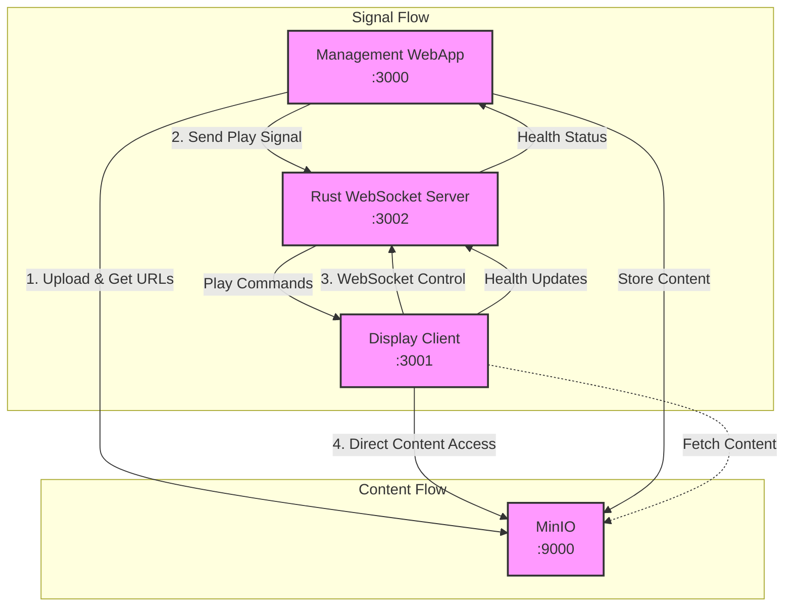

# Wrale Radiate Demo Guide

This guide walks through demonstrating the steel thread implementation of Wrale Radiate.

## Architecture



## Quick Start

1. Start the system:
   ```bash
   # First time setup
   make init
   make up
   
   # Or use the all-in-one command
   make cycle    # Clean, pull latest, initialize, and start
   ```

2. Open the interfaces:
   ```bash
   make open
   ```
   - Management Interface: http://localhost:3000
   - Display Simulator: http://localhost:3001
   - MinIO Console: http://localhost:9001 (minioadmin/minioadmin)

## Demo Walkthrough

### 1. Content Management

The management interface (http://localhost:3000) provides two ways to add content:

#### Option A: Direct URL
1. Click "Use URL" in the content management section
2. Paste this sample video URL:
   ```
   https://file-examples.com/wp-content/storage/2017/04/file_example_MP4_1920_18MG.mp4
   ```
3. Click "Process URL"
4. Watch content status:
   - Upload progress
   - MinIO storage (viewable in console)
   - WebSocket connection status

#### Option B: File Upload
1. Click "Upload File" in the content management section
2. Either:
   - Download the sample video above and upload it, or
   - Use any H.264-encoded MP4 file
3. Watch upload and distribution progress

### 2. Display Client

Connect displays by opening the display simulator (http://localhost:3001). Each tab represents a unique display.

Display States:
- Ready: Connected, waiting for content
- Playing: Currently playing video
- Error: Problem with playback or connection

Features:
- Automatic WebSocket reconnection
- Direct MinIO content access
- Real-time health reporting

### 3. Health Monitoring

The Health Dashboard shows:
- Connection status for each display
- Current content being played
- Last update time
- Error states and messages

To test:
1. Open multiple display tabs
2. Upload new content
3. Observe synchronized playback
4. Try disconnecting/reconnecting displays

## Common Operations

### Viewing Logs
```bash
# All services
make logs

# Specific components
make webapp-logs     # Management interface
make display-logs    # Display simulator
```

### Container Management
```bash
# Access service shells
make shell-webapp
make shell-display

# Stop services
make down

# Full cleanup
make clean
```

## Troubleshooting

### System Health
- Check service status: `make ps`
- Verify MinIO console access: http://localhost:9001
- Check Rust WebSocket server: http://localhost:3002/health

### Common Issues

1. Upload Failures
   - Check file type (must be H.264 MP4)
   - Verify direct video URL (no redirects)
   - Check file size (<100MB for demo)
   - Verify MinIO connection in webapp logs

2. Display Issues
   - Check WebSocket connection (browser console)
   - Verify MinIO URL accessibility
   - Check for codec compatibility
   - Try refreshing display tab

3. Connection Problems
   - Verify all ports are accessible:
     - 3000: Management webapp
     - 3001: Display client
     - 3002: WebSocket server
     - 9000/9001: MinIO
   - Check for connection errors in logs
   - Verify no firewall blocking
