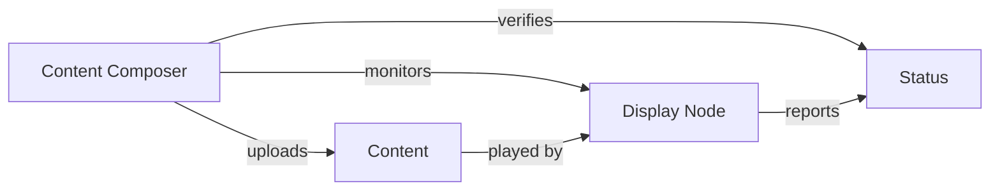

# Actors

Actors are the primary entities that interact with the Wrale Radiate system.

## Core Actors

### [Content Composer](composer/)
Central role responsible for content management and system monitoring.

### [Display Node](display/)
Remote playback point responsible for content presentation.

## Actor Relationships

## Common Characteristics

- All actors operate across geographic locations
- All actors must handle intermittent connectivity
- All actors must support autonomous operation
- All actors must report their operational status