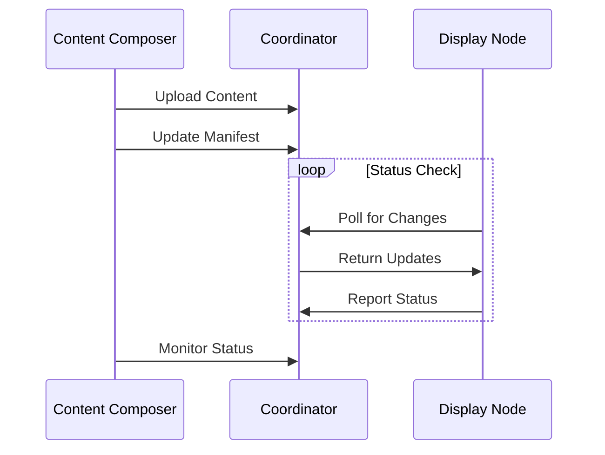

# Interactions

Interactions define how actors work with resources in the Wrale Radiate system.

## Core Interactions

### [Distribution](distribution/)
How content moves through the system.

### [Monitoring](monitoring/)
How system status is tracked and reported.

### [Synchronization](synchronization/)
How timing is coordinated across displays.

## Interaction Patterns

## Common Characteristics

- All interactions are asynchronous
- All interactions handle failures gracefully
- All interactions provide feedback
- All interactions are idempotent where possible