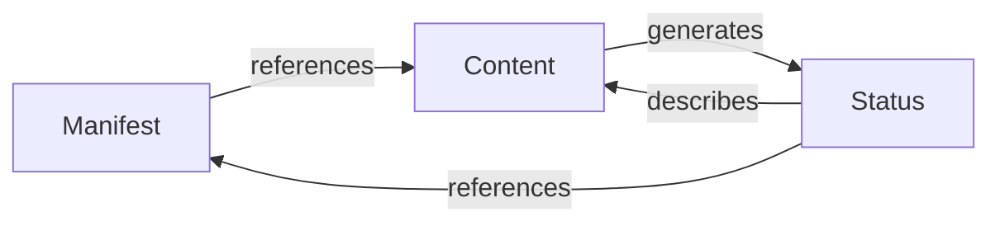

# Resources

Resources are the key entities managed by the Wrale Radiate system.

## Core Resources

### [Content](content/)
The media and other materials to be displayed.

### [Manifest](manifest/)
The specification of what content to play and when.

### [Status](status/)
The system and playback state information.

## Resource Relationships

## Common Characteristics

- All resources have clear ownership
- All resources are versioned
- All resources can be validated
- All resources support caching