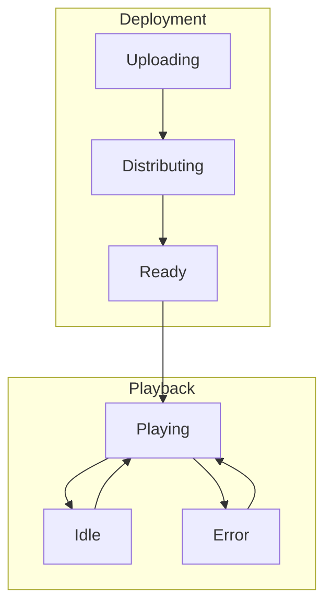

# States

States define the possible conditions of system components and their transitions.

## Core State Groups

### [Playback](playback/)
States related to content playback on display nodes.

### [Deployment](deployment/)
States related to content distribution and activation.

## State Principles

- All states are observable
- All transitions are logged
- All error states have recovery paths
- All components have a known good state

## State Relationships

## Common Characteristics

- All states have clear entry/exit conditions
- All states maintain their invariants
- All states handle interruptions
- All states support monitoring