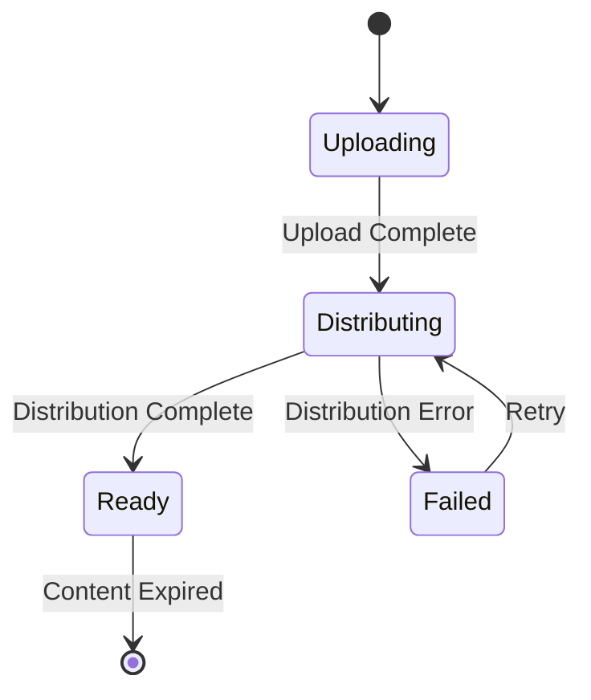

# Deployment States

## Overview
States that represent the content deployment process.

## Primary States

### Uploading
Content being uploaded to system.
- Transfer active
- Progress tracking
- Validation preparing

### Distributing
Content moving to display nodes.
- Transfer to storage
- Node distribution
- Cache updates

### Ready
Content prepared for playback.
- Fully distributed
- Validated everywhere
- Ready for activation

## State Transitions

## State Details

### Uploading State
Conditions:
- Upload in progress
- Source valid
- Space available

Transitions:
- To Distributing: Upload successful
- To Failed: Upload error

Actions:
- Accept content
- Track progress
- Validate chunks

### Distributing State
Conditions:
- Content validated
- Distribution active
- Nodes responding

Transitions:
- To Ready: All nodes prepared
- To Failed: Distribution error

Actions:
- Transfer content
- Update manifests
- Track progress

### Ready State
Conditions:
- Content distributed
- Nodes prepared
- Timing established

Transitions:
- To Failed: Late validation error
- To Expired: Content lifetime end

Actions:
- Monitor readiness
- Track playback
- Handle activation

## Error Handling

### Upload Failures
- Network issues
- Space problems
- Format errors

### Distribution Problems
- Node unreachable
- Validation failed
- Cache issues

### Recovery
- Automatic retry
- Partial resume
- Node healing