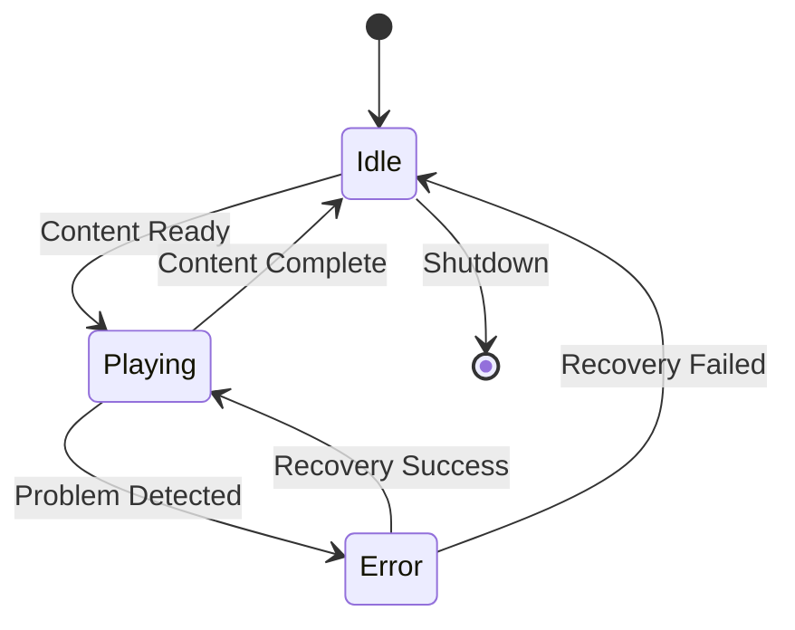

# Playback States

## Overview
States that represent the playback condition of display nodes.

## Primary States

### Idle
Not actively playing content.
- Waiting for content
- Ready for playback
- Maintaining heartbeat

### Playing
Normal content playback.
- Content validated
- Timing synchronized
- Metrics reporting

### Error
Problem with playback.
- Error identified
- Recovery attempting
- Using fallback

## State Transitions

## State Details

### Idle State
Conditions:
- System operational
- No active playback
- Ready for content

Transitions:
- To Playing: When content and timing ready
- To Error: If system problem detected

Actions:
- Monitor system health
- Check for new content
- Maintain readiness

### Playing State
Conditions:
- Content validated
- Playback active
- Metrics normal

Transitions:
- To Error: On playback problems
- To Idle: When content complete

Actions:
- Play content
- Report metrics
- Monitor sync

### Error State
Conditions:
- Problem detected
- Recovery active
- Fallback engaged

Transitions:
- To Playing: When recovered
- To Idle: If recovery fails

Actions:
- Attempt recovery
- Use fallback content
- Report status

## Error Handling

### Detection
- Playback interruption
- Quality problems
- Sync issues
- System errors

### Recovery
- Automatic retry
- Fallback content
- System restart if needed

### Reporting
- Error details
- Recovery attempts
- Resolution status